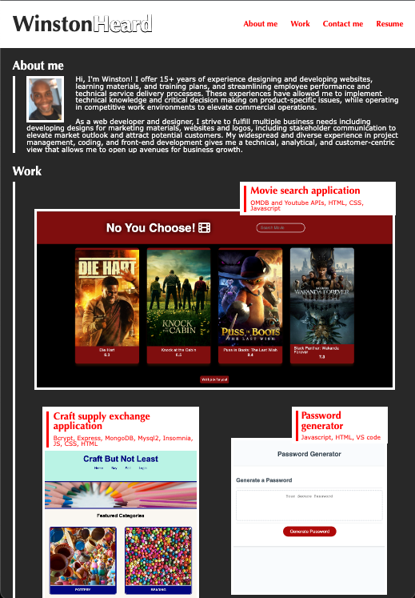

# Portfolio

## Table of Contents

- [Overview](#overview)
- [Preview](#preview)
- [Deployed Link](#deployed-link)

## Overview

As a developer, I want to showcase my projects that were developed while participating in the Full Stack Bootcamp progam.
I want to use this portfolio to show how my development and design skills have been used practically.
I want to do this so that future employers can see the skills and experience that I have to offer them.

## Preview

## Deployed Link

[Link to portfolio](https://winstonheard.github.io/portfolio/) 

